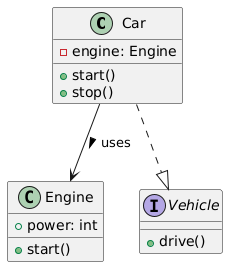
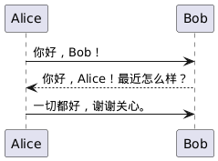
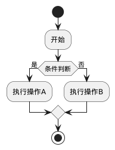
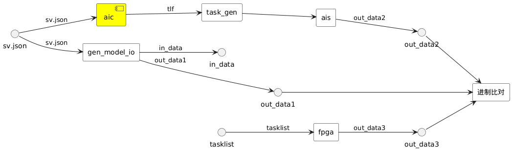

# 简介

基于markdown+plantuml的 文档生成套件，用于生成各种文档。
  
## 1. 使用说明

### 1.1 生成当前样例
直接执行:
```bash
bash build_doc.sh
```
### 1.2 在你的项目中使用

1. 将被本项目已submodule的形式添加到你的git项目中
2. 在你的项目中创建专门的文档文件夹，文件夹中放有markdown文件
3. 在该文件夹中直接执行`build.py`


## 2. 示例文档

### 2.1 插入数学公式

$$
\int_0^\infty e^{-x} dx = 1
$$

### 2.2 插入表格

| 名称          | 说明               | 状态    |
|---------------|--------------------|---------|
| **项目A**     | 进行中             | ✅      |
| *项目B*       | 已完成             | ✔️      |
| `项目C`       | 待启动             | ❌      |


### 2.3 插入图表

1. 类图  
     

2. 时序图  
     

3. 流程图  
     

4. 系统架构投图
   
   
## 附录

1. [plantuml学习](https://plantuml.com/zh/guide)
2. [plantuml教程](https://plantuml.com/zh/sequence-diagram)
3. [markdown学习](https://markdown.com.cn/basic-syntax/)
